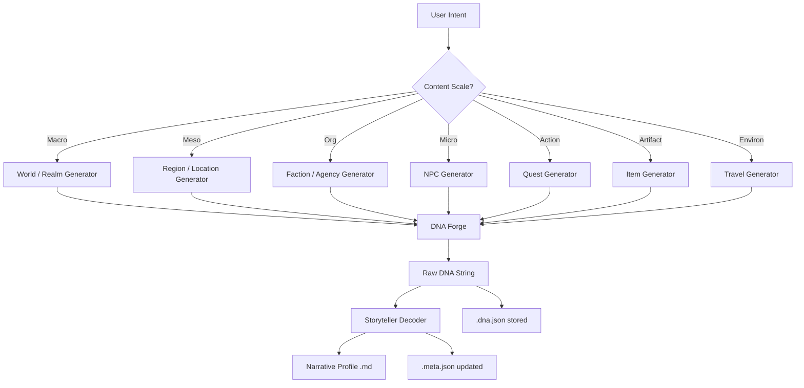

# Conductor Routing

> The operational dispatch table for the AI Conductor. This document maps user intent to the correct generation pipeline, defining which generator, decoder, template, and output directory is invoked for every supported content type.

---

## Routing Decision Flow

---

## Content Type Dispatch Table

### Macro Scale — World & Realm

| Field | Value |
|:------|:------|
| **User Intent** | "Create a world", "Build a setting", "Generate a realm" |
| **Generator** | `world_generator.py` |
| **Decoder** | `prompt_decode_world.txt` |
| **Template** | [[Template_World]] |
| **Output Directory** | `01_Foundation_and_Cosmology/` + `02_Geography_and_Environment/` |
| **DNA Blocks** | Top-Level Scales (T/M/A), COSMO{}, ECON{}, MAG{}, ORIGIN{}, ENV{}, SOC{}, CON{}, HIS{}, FACT, PANTHEON, CRIT{}, CHAIN{}, EVO{}, TREND{} |
| **Parent** | None (root entity) |
| **Children** | Regions, Global Factions, Species, Magic Systems |

---

### Meso Scale — Region

| Field | Value |
|:------|:------|
| **User Intent** | "Create a region", "Detail a province", "Flesh out an area" |
| **Generator** | `world_generator.py` (regional mode) |
| **Decoder** | `prompt_decode_world.txt` (regional focus) |
| **Template** | [[Template_Region]] |
| **Output Directory** | `02_Geography_and_Environment/Region_[Name]/` |
| **Key Feature** | Supports **DNA Focus** modifiers (e.g., "Make it more dangerous") |
| **Parent** | [[Template_World\|World]] |
| **Children** | Settlements, Local Factions, Adventure Sites |

---

### Meso Scale — Settlement / Location (Adventure Site)

| Field | Value |
|:------|:------|
| **User Intent** | "Create a city", "Generate a dungeon", "Build a village" |
| **Generator** | `location_generator.py` |
| **Decoder** | `prompt_location_finalized.txt` |
| **Template** | [[Template_Settlement]] |
| **Output Directory** | `03_Polities_and_Cultures/` |
| **DNA Blocks** | STRUCT{}, POP{}, ECON{}, POL{}, POI{}, CHAIN{}, PROXI{}, EVO{} |
| **Parent** | [[Template_Region\|Region]] |
| **Children** | Establishments, NPCs, Local Quests |

---

### Organization Scale — Faction / Agency

| Field | Value |
|:------|:------|
| **User Intent** | "Create a faction", "Generate a guild", "Build an organization" |
| **Generator** | `generator_faction.py` |
| **Decoder** | `prompt_decode_faction.txt` |
| **Template** | [[Template_Faction]] |
| **Output Directory** | `04_Factions_Organizations_Religions/` |
| **DNA Tags** | T#, G#, M#, P#, S#, O#, N#, L#, F#, D#, A#, SC#, MZ#, X# (14 tags) |
| **Parent** | [[Template_Region\|Region]] or [[Template_Settlement\|Settlement]] |
| **Children** | Member NPCs, Controlled Establishments |

---

### Micro Scale — NPC

| Field | Value |
|:------|:------|
| **User Intent** | "Create an NPC", "Generate a character", "Build a villain" |
| **Generator** | `npc_generator.py` |
| **Decoder** | `prompt_npc.txt` |
| **Template** | [[Template_NPC]] |
| **Output Directory** | `08_Adventure_Content/` |
| **DNA System** | 81-point alignment matrix (LNC 1-9 × GNE 1-9), Paired + Unpaired personality traits |
| **Key Feature** | Outputs a **Beliefs-Desires-Intentions (BDI)** framework |
| **Parent** | [[Template_Settlement\|Settlement]], [[Template_Faction\|Faction]], or [[Template_Quest\|Quest]] |

---

### Action Scale — Quest

| Field | Value |
|:------|:------|
| **User Intent** | "Create a quest", "Generate an adventure", "Build a mission" |
| **Generator** | `generator_quest.py` |
| **Decoder** | `prompt_decode_quest.txt` |
| **Template** | [[Template_Quest]] |
| **Output Directory** | `08_Adventure_Content/` |
| **DNA Blocks** | GOAL{}, OBS{}, REWARD{}, NARR{}, MOTIV{}, CHAIN{}, ENGAGE{}, EVO{} |
| **Key Feature** | **Reconciliation Engine** — High obstacles + low engagement = bypass/mitigation design |
| **Parent** | [[Template_Region\|Region]] or [[Template_Settlement\|Settlement]] |
| **Children** | Related NPCs, Reward Items |

---

### Artifact Scale — Magic Item / Relic

| Field | Value |
|:------|:------|
| **User Intent** | "Create an item", "Forge a relic", "Generate a weapon" |
| **Generator** | `item_generator.py` |
| **Decoder** | `prompt_item.txt` |
| **Template** | [[Template_Item]] |
| **Output Directory** | `07_History_Timeline_Legends/` |
| **DNA Blocks** | PHY{}, MAG{}, HIS{}, LOR{}, ATTUNE{}, CHAIN{}, EVO{} |
| **Key Feature** | Items evolve dynamically via EVO tracks over campaign time |
| **Parent** | Any (creator NPC, faction, location, quest) |

---

### Environmental Scale — Travel Scenario

| Field | Value |
|:------|:------|
| **User Intent** | "Create a journey", "Generate travel", "Build a route" |
| **Generator** | `travel_generator.py` |
| **Decoder** | `Travel DNA Prompt GPT.txt` |
| **Template** | [[Template_Travel]] |
| **Output Directory** | `08_Adventure_Content/` |
| **DNA Format** | `TRAVEL{D-S}` (Danger-Discovery, minimal) |
| **Key Feature** | Supports bias modifiers for safer/more dangerous journeys |
| **Parent** | [[Template_Region\|Region]] |

---

## Pre-Generation Checklist

Before invoking any generator, the Conductor must:

1. **Identify parent entity** — Does a parent `.meta.json` exist? Load its locked fields.
2. **Collect GM context** — Any user-provided overrides, tone preferences, or setting details.
3. **Check for siblings** — Are there existing entities in the same scope? Load their constraints.
4. **Apply DNA Focus** (optional) — User-requested bias modifiers that skew generation probabilities.
5. **Route to generator** — Use the dispatch table above to select the correct pipeline.

## Post-Generation Checklist

After decoding output:

1. **Store `.dna.json`** — Save the raw DNA string with metadata.
2. **Create/update `.meta.json`** — Record field locks, inheritance, and incomplete fields.
3. **Write `.md` profile** — Save the narrative using the correct [[_99_Templates_and_Patterns_Index|template]].
4. **Push upward** — If parent fields are empty, push child-defined values per [[Metadata_Priority_Logic#The First Child Wins Protocol|First Child Wins]].
5. **Update indexes** — Add `[[wiki-links]]` to the relevant directory index.
6. **Cross-link** — Ensure all related entities are `[[wiki-linked]]` bidirectionally.

---

## Related Documents

- [[DNA_System_Rules]] — Full system architecture, narrative mandates, Resolution Engine
- [[Metadata_Priority_Logic]] — Data hierarchy, Thin Parent, field locking
- [[Entity_Master_Index]] — Master dashboard of all generated entities

## Related Entities

- [[_00_Admin_and_Indexes_Index]]
